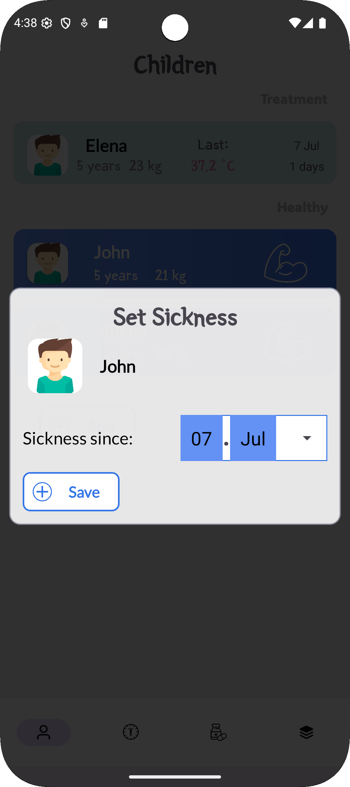
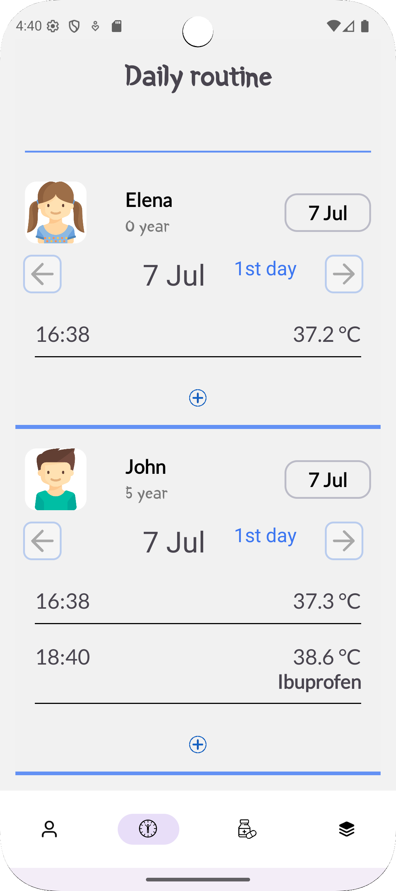
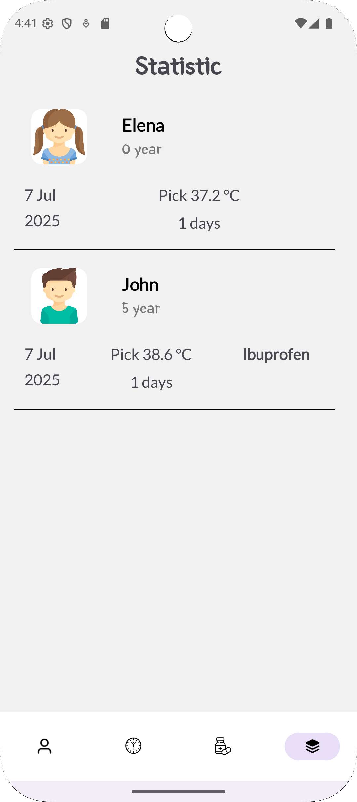

# MediMom

**MediMom** is an Android application built with Kotlin, designed to help parents track their children's health. It allows you to monitor body temperature, manage medication intake, and keep a clear and organized health history for each child.

## 📱 Screenshots

&nbsp;&nbsp;&nbsp;&nbsp;&nbsp;&nbsp;&nbsp;&nbsp;&nbsp;&nbsp;&nbsp;&nbsp;&nbsp;&nbsp;&nbsp;&nbsp;&nbsp;&nbsp;&nbsp;&nbsp;&nbsp;&nbsp;&nbsp;&nbsp;

## ✨ Features

- 👶 Manage profiles for multiple children
- 🌡️ Log body temperature measurements
- 💊 Track medication usage
- 📆 Group data by date and child
- 📷 Attach photos to children and medicines
- 🔍 Filter and browse history easily
- 📊 View structured and categorized health data

## 🛠 Tech Stack
- **Kotlin**
- **MVVM architecture** with Repository pattern
- **Jetpack Components**: ViewModel, LiveData, Room, Navigation
- **Room Database** for local persistence
- **Material Design UI**
- **BottomNavigationView** for intuitive multi-screen navigation
- **ActivityResult API** for image selection


## 📁 Project Structure

app/  
  ├── adapters/ &nbsp;&nbsp;&nbsp;&nbsp;&nbsp;&nbsp;&nbsp;&nbsp;&nbsp;&nbsp; # RecyclerView adapters<br>
  ├── dao/ &nbsp;&nbsp;&nbsp; &nbsp;&nbsp;&nbsp;&nbsp;&nbsp;&nbsp;&nbsp;&nbsp;&nbsp;&nbsp;&nbsp;&nbsp;&nbsp;&nbsp; # Data Access Object<br>
  ├── data/ &nbsp;&nbsp; &nbsp;&nbsp;&nbsp;&nbsp;&nbsp;&nbsp;&nbsp;&nbsp;&nbsp;&nbsp;&nbsp;&nbsp;&nbsp;&nbsp; # AppDatabase, Repository, MainViewModel...<br>
  ├── entity/ &nbsp;&nbsp;&nbsp;&nbsp;&nbsp;&nbsp;&nbsp;&nbsp;&nbsp;&nbsp;&nbsp;&nbsp;&nbsp;&nbsp;&nbsp; # Room entities<br>
  ├── filter/ &nbsp; &nbsp;&nbsp;&nbsp;&nbsp;&nbsp;&nbsp;&nbsp;&nbsp;&nbsp;&nbsp;&nbsp;&nbsp;&nbsp;&nbsp;&nbsp; # Filter for UI report<br>
  ├── fragment/ &nbsp; &nbsp;&nbsp;&nbsp;&nbsp;&nbsp;&nbsp;&nbsp;&nbsp; # UI fragments<br>
  ├── info/ &nbsp;&nbsp;&nbsp;&nbsp;&nbsp;&nbsp;&nbsp;&nbsp;&nbsp;&nbsp;&nbsp;&nbsp;&nbsp;&nbsp;&nbsp;&nbsp;&nbsp;&nbsp; # ViewModel classes<br>
  └── util/ &nbsp;&nbsp;&nbsp;&nbsp;&nbsp;&nbsp;&nbsp;&nbsp;&nbsp;&nbsp;&nbsp;&nbsp;&nbsp;&nbsp;&nbsp;&nbsp;&nbsp;&nbsp;&nbsp; # Utility classes and helpers<br>

## Privacy Policy

This application respects your privacy. You can read the full privacy policy here:

👉 [Privacy Policy](https://maksimtest.github.io/KotlinMediMom/privacy-policy.html)

## 🚀 Getting Started

1. Clone the repository:
   ```bash
   git clone https://github.com/maksimtest/KotlinMediMom.git
   ```
2. Open the project in Android Studio Arctic Fox or newer.
3. Let Gradle sync and build the project.
4. Run the app on an emulator or Android device.
