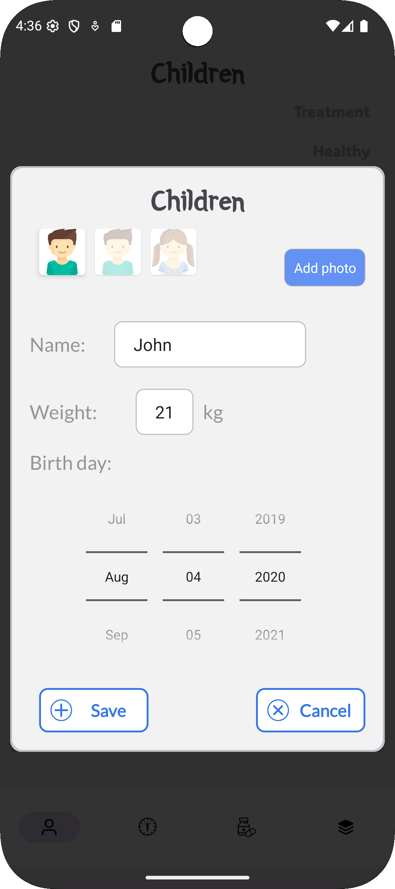

# MediMom

**MediMom** is an Android application built with Kotlin, designed to help parents track their children's health. It allows you to monitor body temperature, manage medication intake, and keep a clear and organized health history for each child.

## 📱 Screenshots


*(Insert screenshots here if available)*

- r


- f
- 
<p float="left">
  
  
</p>

## ✨ Features

- 👶 Manage profiles for multiple children
- 🌡️ Log body temperature measurements
- 💊 Track medication usage
- 📆 Group data by date and child
- 📷 Attach photos to children and medicines
- 🔍 Filter and browse history easily
- 📊 View structured and categorized health data

## 🛠 Tech Stack

- **Kotlin**
- **Jetpack Components**: ViewModel, LiveData, Room, Navigation
- **Room Database** for local persistence
- **Coroutines** for async operations
- **Material Design UI**
- **ActivityResult API** for image selection

## 📁 Project Structure

app/  
  ├── data/ # Database, repositories<br>
  ├── entity/ # Room entities<br>
  ├── fragment/ # UI fragments<br>
  ├── adapter/ # RecyclerView adapters<br>
  ├── viewmodel/ # ViewModel classes<br>
  ├── utils/ # Utility classes and helpers<br>
  └── info/ # Display models (DTOs)<br>

## Privacy Policy

This application respects your privacy. You can read the full privacy policy here:

👉 [Privacy Policy](./privacy-policy.html)

## 🚀 Getting Started

1. Clone the repository:
   ```bash
   git clone https://github.com/your-username/MediMom.git
   ```
2. Open the project in Android Studio Arctic Fox or newer.
3. Let Gradle sync and build the project.
4. Run the app on an emulator or Android device.
